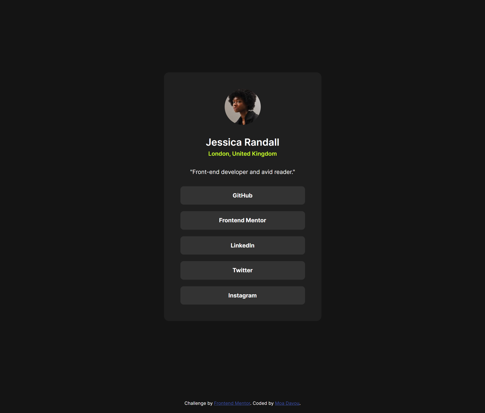

# Frontend Mentor - Social links profile solution

This is a solution to the [Social links profile challenge on Frontend Mentor](https://www.frontendmentor.io/challenges/social-links-profile-UG32l9m6dQ). Frontend Mentor challenges help you improve your coding skills by building realistic projects.

## Table of contents

- [Overview](#overview)
  - [The challenge](#the-challenge)
  - [Screenshot](#screenshot)
  - [Links](#links)
- [My process](#my-process)
  - [Built with](#built-with)
  - [What I learned](#what-i-learned)
  - [Continued development](#continued-development)
  - [Useful resources](#useful-resources)
- [Author](#author)

## Overview

### The challenge

Users should be able to:

- See hover and focus states for all interactive elements on the page

### Screenshot

### Links

- Repository URL: [GitHub](https://github.com/moadavou/social-links-profile)
- Live Site URL: [GitHub Pages](https://moadavou.github.io/social-links-profile/)

## My process

### Built with

- Semantic HTML5 markup
- CSS custom properties
- Flexbox
- CSS Grid
- Mobile-first workflow

### What I learned

During this project, I learned about the **62.5% Font Size Trick**. ~~From what I understand, there are few, if any, disadvantages to using this trick.~~ After reading about this topic I understood that this trick is not as great as it sounds. [Grace Snow wrote a great article about why.](https://fedmentor.dev/posts/rem-html-font-size-hack/) A few articles recommended using CSS variables instead. I can see the advantage of this, especially if I'm using utility classes for the project.

Speaking of **utility classes**. I just learned that they exist. They don't seem useful for small projects like this one, but I will definitely use them in the future.

I have also been researching when to use `grid` or `flexbox` since, I'm almost exclusively use flexbox right now. [Kevin Powell made an amazing video diving deep into this.](https://www.youtube.com/watch?v=3elGSZSWTbM)

### Continued development

I want to use `grid` more in the future. It's also important to me to continue to learn about best practices and accessibility.

Units like `rem` and `em` are still a little unclear to me. I understand what they do. But I don't fully understand when to use what and why. I need to do some more research!

### Useful resources

- [62.5% Font Size Trick](https://www.aleksandrhovhannisyan.com/blog/62-5-percent-font-size-trick/) - This helped me learn about this trick, what it is and why it works.
- [The Surprising Truth About Pixels and Accessibility](https://www.joshwcomeau.com/css/surprising-truth-about-pixels-and-accessibility/#bonus-rem-quality-of-life-12) - This is an amazing article which helped me understand more about CSS units and accesability. They also included options for the 62.5% Font Size Trick.

## Author

- Frontend Mentor - [@moadavou](https://www.frontendmentor.io/profile/moadavou)
- GitHub - [@moadavou](https://github.com/moadavou)
